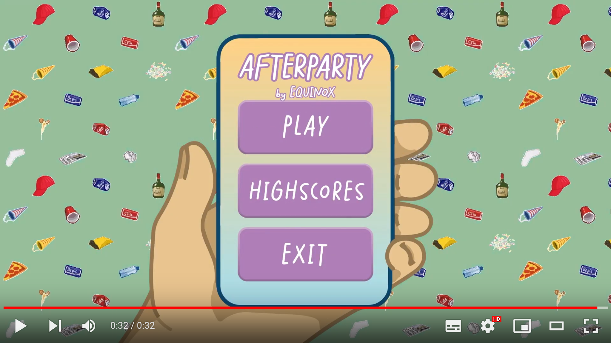
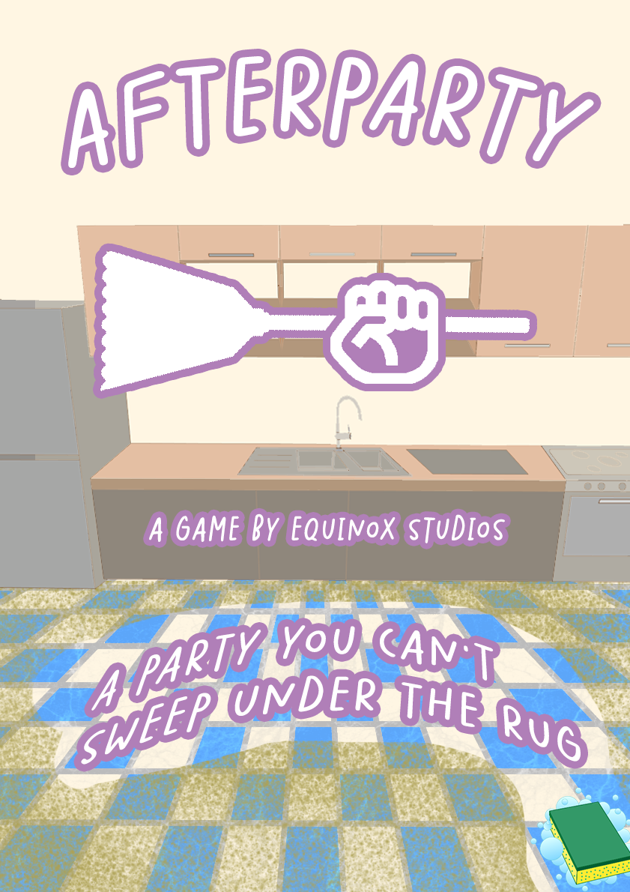

# Afterparty (CMGT-PointAndClick)

Afterparty is a hectic and fast-paced game in which you must clean up the house, after a party before your parents arrive home in five minutes.

## Trailer

## About this game
### The premise
In this game you're voilently woken up after a rowdy night spent partying with your mates by a message from your parents:\
_They'll be home soon!_\
But the house is still a giant mess! You have five minutes to clean up before your parents come home.
### The tasks
You must gather all the trash spread throughout the house in your garbage bag and trow it out!
But you must also vacuum the carpet, do the dishes and more!
### Score
The game features an advanced scoring system to encourge you to keep improving! The better and faster you clean up, the higher your score will be!\
One of the devs' highscores is included in the game to give you a goal to play towards!

## Poster

## [Click here to download the game!](../../releases/latest)

## Credits
**Artists** | **Designers** | **Engineers**
--- | --- | ---
[@Aspecko](https://github.com/Aspecko) | [@FrogBalls2](https://github.com/FrogBalls2) | [@Yukki16](https://github.com/Yukki16)
[@Lennard](https://github.com/Lunnurd) | [@PetarTr02](https://github.com/PetarTr02) | [@TechnicJelle](https://github.com/TechnicJelle)
